# Function Calls Under the Hood

**What happens when you call a function?**

A visual guide to understanding function call principles through assembly language.

---

## About This Guide

This visual guide explains how function calls work at the low level, using detailed diagrams to illustrate the complete stack evolution during function execution. Through hands-on examples on the x86-64 platform, you'll gain a solid understanding of how C code translates to assembly instructions. The guide concludes with practical examples demonstrating interesting stack frame behaviors.

### What You Will Learn

- How control transfers between functions
- How data is passed between functions
- How stack frames are created and destroyed
- The dangers of array out-of-bounds access in C/C++
- Why inline functions are more efficient
- Why loops are preferred over recursion
- Why static variables persist after function returns
- What stack overflow attacks are and how they work

### Notes

This guide does not cover `memory alignment`, as it falls outside the scope of function calls. The examples were carefully constructed to avoid compiler-generated alignment instructions. If you're interested in memory alignment, there are many online resources available.

### References

- Books:
  - "Computer Systems: A Programmer's Perspective" (3rd Edition)

- Online Courses:
  - ["Programming Paradigms" (Stanford CS107)](https://see.stanford.edu/course/cs107)

### Acknowledgments

All diagrams were created with [Excalidraw](https://excalidraw.com/).

---

## Table of Contents

1. [Chapter 1: Prerequisites](#chapter-1-prerequisites)
2. [Chapter 2: The Stack in Memory](#chapter-2-the-stack-in-memory)
3. [Chapter 3: Control Transfer](#chapter-3-control-transfer)
4. [Chapter 4: Data Passing](#chapter-4-data-passing)
5. [Chapter 5: Register Saving and Restoring](#chapter-5-register-saving-and-restoring)
6. [Chapter 6: Storage of Local Variables](#chapter-6-storage-of-local-variables)
7. [Chapter 7: Function Stack Frame](#chapter-7-function-stack-frame)
8. [Chapter 8: C Function Stack Frame Example](#chapter-8-c-function-stack-frame-example)
9. [Chapter 9: Stack Frame Memory Reuse](#chapter-9-stack-frame-memory-reuse)
10. [Chapter 10: Manually Modifying Stack Frame Data](#chapter-10-manually-modifying-stack-frame-data)
11. [Chapter 11: Summary](#chapter-11-summary)

---

# Chapter 1: Prerequisites

> This section provides a brief introduction to some fundamental concepts to help you better understand the following content.

## 1.1 Function Definition

> A function in computing (sometimes called a procedure or method) provides a way to `encapsulate code`, implementing certain functionality with a set of specified parameters and an optional return value. This function can then be called from different places in the program. The `caller` can pass a set of parameters to the `callee`, and after execution, the `callee` can return the result to the `caller`.

When making a function call, the computer needs to provide the following mechanisms at the low level:

- **Control Transfer**

  The `control` needs to be transferred to the called function, and after the called function `finishes execution`, it needs to return to the original location to continue execution.

- **Data Passing**

  The caller can `pass parameters` to the callee, and the callee can also `return data` to the caller.

- **Memory Allocation and Deallocation**

  At the beginning, `local memory` may need to be allocated for the callee to store `local variables`, and this memory must be deallocated when the function returns.

## 1.2 Stack

A stack is a data structure that can be understood as a container for data. It has the `First In, Last Out` (FILO, also equivalent to Last In, First Out - LIFO) property, meaning the data that enters the `stack` first will come out last. You can imagine it as a pile of books on your desk - you can only take the top book, and new books can only be placed on top. Or you can think of it like the clothes you wear - the first clothes you put on are the last ones you take off. Therefore, there are two important operations for a `stack`: `push` and `pop`. `Push` means adding new data to the top of the stack, and `pop` means removing data from the top of the stack. The stack data structure has a `memory feature`, meaning the popped value is always the most recently pushed value that is still in the stack.

## 1.3 Memory

Memory is a `contiguous` storage area in a computer, organized as a collection of countless contiguous units, each `byte` (8 binary bits) in size. Each `memory unit` is provided with a unique `memory address` for the computer to easily access a specific memory unit, meaning every byte has a `memory address`. For example, the address of the first byte is 0, the adjacent second byte's address is 1, and so on. We call the end with larger memory addresses the `high address`, and the end with smaller memory addresses the `low address`.

## 1.4 Assembly Instructions

`Assembly language` is a language that works directly on the machine. Computers can only recognize binary sequences composed of 0s and 1s, so the CPU can only execute `machine instructions` composed of 0s and 1s. Assembly language is a `mnemonic` for machine instructions, making it easier for humans to identify and remember. Each assembly instruction corresponds to one or more machine instructions. In this article, we will use pseudocode similar to C language to describe the stack changes.

## 1.5 Registers

Inside the `CPU`, there is a set of storage units used to hold small temporary data, called `registers`. Registers have much faster access speeds than memory, speeding up computer program execution through quick data access. When the CPU wants to access data in memory, it must first transfer the data from memory to registers, and then the CPU reads from the registers. Registers are at the top of the memory hierarchy and are the fastest storage the CPU can read and write. Each register has a specific name, and different registers have different purposes.

---

# Chapter 2: The Stack in Memory

> The operating system allocates `memory space` for a `process` (a running application) to store the code and data needed during program execution. Based on different memory usage patterns, memory is divided into several regions with different functions. One of these regions is called the `stack` (in this article specifically referring to the call stack), which has the same `Last In, First Out` property as the stack data structure. The `stack` is used to record information generated during function calls, such as function local variables and parameters. The `stack` mentioned later in this article refers to this memory stack.

The CPU provides instructions for `push` and `pop` operations on stack memory, and there is also a register called the `stack pointer` (sp) that holds the `memory address` of the `top of the stack`. `Stack memory` grows from `high addresses` to `low addresses`, which is a bit counterintuitive - when you `push` new data onto the `stack`, the stack address decreases.

**For convenience, each cell in all stack diagrams in this article represents 8 bytes, and we also assume that push and pop instructions operate on 8 bytes at a time**.

The diagram below shows a `stack` of 80 bytes (each cell in the diagram is 8 bytes), with an address range of 0~79. The `stack pointer` points to the top of the stack:


**The instructions mentioned later are pseudocode similar to C language, used only to describe the stack changes.**

## 2.1 Push

When pushing, the `stack pointer` moves toward `lower addresses` (i.e., the stack pointer decreases), and then data is written to the memory starting at the `stack pointer`.

For example, to push the value `123` onto the stack, the corresponding instruction is:

```c
push(123);
```

Its effect is equivalent to these two instructions:

```c
sp = sp - 8;
*sp = 123;
```

Since we assume the push instruction operates on 8 bytes at a time, the first instruction moves `sp` (stack pointer) 8 bytes toward lower addresses. Then the second instruction writes the data to the 8 bytes of memory starting at `sp`. `*sp` represents the memory space pointed to by the `stack pointer`, not the `stack pointer` itself.

Stack change process:


## 2.2 Pop

When popping, first retrieve the 8 bytes of data starting at the `stack pointer` (we assume pop operates on 8 bytes at a time), then move the `stack pointer` 8 bytes toward higher addresses (i.e., increase the stack pointer).

To pop the data at the `top of the stack` from the push example into variable `rax`, the corresponding instruction is:

```c
pop(rax);
```

Its effect is equivalent to these two instructions:

```c
rax = *sp;
sp = sp + 8;
```

First, put the 8 bytes of data starting at the `stack pointer` into variable `rax`. Since we pushed 123 in the push example, the data popped is also 123. Finally, move the `stack pointer` 8 bytes toward higher addresses.

Stack change process:


---

# Chapter 3: Control Transfer

> When making a function call, `control` needs to be transferred to the `called function`, and after the called function finishes execution, it needs to return to the original location to continue execution.

We already know that the operating system divides a process's `memory space` into several regions with different functions. In addition to the `stack segment` (also called the stack) mentioned earlier, there is also a region called the `code segment`, which stores the machine instructions needed during the process's execution. When the CPU reads instructions, it needs to know which instruction to execute next. Therefore, the CPU provides a register called the `Program Counter` (PC) to store the memory address of the instruction the CPU is currently executing in the `code segment`.

Since the CPU always gets the instruction address from the `PC`, when a function call occurs, we can modify the `PC` to the `starting address` of the `callee's` instructions, and the CPU will start executing from the `callee`. After the `callee` finishes execution, to let the CPU continue executing from the original location, we can modify the `PC` again to the address of the `next instruction` after the call site. This address is called the function's `return address`.

Consider the following C code:

```c
void Q() {
    printf("this is Q.");
    return;
}

void P() {
    printf("readying to call Q.");
    Q();
    return;
}
```

Let's assume the `line number` is the `instruction address`. Initially, PC is 7, which is function `P`'s starting instruction address. As the CPU executes downward and encounters a function call, it modifies PC to the starting instruction address 2 of the called function `Q`. After `Q` finishes execution, PC is modified to the address 9 of the next instruction after calling `Q` in `P`, and the entire call process ends.

Now there's a problem with saving the function's `return address`. Consider when there are many nested function calls - each function call generates a return address, and these return addresses need to be associated with each call. To meet this requirement, we need to use a `stack` to store the function's `return addresses`. Each time a call occurs, the `return address` is pushed onto the `stack`, and after the function finishes execution, it is popped from the stack into the `PC`.

Here's an example of nested function calls in C. Let's explain both the call and return processes:

```c
void Q() {
    printf("this is Q.\n");
    return;
}

void P() {
    printf("readying to call Q.\n");
    Q();
    return;
}

void main() {
    printf("readying to call P.\n");
    P();
    return;
}
```

## 3.1 Call Process

Again assuming the `line number` is each instruction's address, initially PC is 13, which is the first line of the `main` function. The program continues to line 14, where it calls function `P`. First, the address 15 of the next instruction after the call to `P` is pushed onto the stack, then `PC` is set to P's starting instruction address 7. The program continues to line 8, where it calls function `Q`. Similarly, first the address 9 of the next instruction after calling `Q` is pushed onto the stack, then PC is set to `Q`'s starting instruction address 2. At this point, the stack stores two `return addresses`: 9 and 15.

Stack change process:


## 3.2 Return Process

After function `Q` finishes execution, the function begins to return. When returning, the previously saved `return address` is popped from the stack into PC. At this point, the top of the stack is instruction address 9, which is popped from the stack into PC, and the function successfully returns to `P`. After `P` finishes execution, instruction address 15 at the top of the stack is popped into PC, and finally the function returns to `main`, with the stack restored to its state before the calls.

Stack change process:


This entire process can be extended to any level of function calls and recursive calls - the stack perfectly preserves function return addresses. For convenience in this example, we treated one line of C code as one instruction. In reality, instructions are `machine instructions` after compilation, and one line of C code may correspond to multiple machine instructions, each with its own address in memory.

---

# Chapter 4: Data Passing

> Sometimes the caller needs to `pass parameters` to the callee, and the callee may also need to `return data` to the caller.

## 4.1 Parameter Passing

By default, in `X64` (Intel 64-bit), the first 6 parameters are stored in a set of designated registers, and the remaining parameters are pushed onto the `stack` in `right-to-left` order. Therefore, the callee can access this set of registers or the `stack` to obtain parameters. In `X86` (Intel 32-bit), all parameters are directly pushed onto the stack in `right-to-left` order, so the callee only needs to access the `stack` to obtain parameters.

In the X64 System V AMD64 ABI, the first 6 integer/pointer parameters are passed using the following registers in order:

| Parameter Order | Register |
|----------------|----------|
| 1st | rdi |
| 2nd | rsi |
| 3rd | rdx |
| 4th | rcx |
| 5th | r8 |
| 6th | r9 |

Additionally, if the called function references the memory address of a parameter, that parameter must also be placed on the stack, because registers don't have memory addresses.

Example of parameter passing in C (using `X64`):

```C
void Q(long arg1, long arg2, long arg3, long arg4, long arg5, long arg6, long arg7, long arg8) {
    printf("this is Q.\n");
    return;
}

void main() {
    printf("readying to call Q.\n");
    Q(1, 2, 3, 4 ,5 ,6 ,7 ,8);
    return;
}
```

In the code above, function `Q` has 8 parameters. The first 6 parameters are passed through registers, and the extra 2 parameters `arg7` and `arg8` are pushed onto the stack in `right-to-left` order, so the push order here is `arg8` first, then `arg7`. We use `long` type here for easier illustration, as it occupies 8 bytes, which corresponds to one cell in the diagram.

Push process:


## 4.2 Return Value

A function can have at most one return value, so it's usually placed directly in a register, and then the caller retrieves the return value from this register. In X64, the return value is stored in the `rax` register.

---

# Chapter 5: Register Saving and Restoring

> During a `function call`, it's possible that the `caller` uses a certain register, and the `callee` also uses this register and modifies its value. If the caller still needs to use the previous value in this register after the call ends, the `caller's` state would be `corrupted`. Therefore, during function calls, the value in this register needs to be saved, and restored to its `pre-call state` when the function returns.

Since the `stack` data structure has a `memory feature` - when you push an element onto the stack and then `pop`, the `popped` element is still the element you previously pushed - the `stack` is commonly used for `saving and restoring` registers. First, push the register values onto the `stack` to save them, then modify them, and finally restore the previously saved values from the `stack` back to the registers one by one.

The following code saves the `ax` and `bx` registers onto the stack:

```c
push(ax);
push(bx);
```

Saving process:


Restore the values from the stack back to the registers one by one:

```c
pop(bx);
pop(ax);
```

Restoring process:


Note that the pop and push orders are reversed. Since the `top of the stack` now contains the previous value of `bx`, when restoring, we first pop the value at the `top of the stack` into `bx`, then pop the next value into `ax`. This way, the values are matched to the correct registers.

## 5.1 Register Classification

**Not all registers need to be `saved and restored`. By convention, registers are divided into `callee-saved` and `caller-saved`:**

In the X64 System V ABI, registers are classified as follows:

| Type | Registers |
|------|-----------|
| Callee-saved | rbx, rbp, r12, r13, r14, r15 |
| Caller-saved | rax, rcx, rdx, rsi, rdi, r8, r9, r10, r11 |
| Stack pointer | rsp (special, must be preserved) |

### Callee-saved

The `callee` is responsible for `saving and restoring` this set of registers. Since every function is a `callee` (because functions only run after being called), we can conclude that any function modifying these registers must `save and restore` them.

For example, when function P calls function Q, when Q is executed, Q first pushes the registers from this set that it needs to modify onto the `stack` for saving. Finally, when returning, Q is responsible for popping the saved values from the stack back to these registers for restoration.

### Caller-saved

Registers other than `callee-saved` and the `stack pointer` (sp) are called `caller-saved` registers. Since every function is a `callee`, we can conclude that any function modifying these registers does not need to `save and restore` them.

For example, when function P calls function Q, before Q is executed, P first pushes the registers from this set that it doesn't want to `change` when Q returns onto the `stack` for saving. Finally, after Q returns, P is responsible for popping the saved values from the stack back to these registers for restoration.

---

# Chapter 6: Storage of Local Variables

> Both registers and memory can be used to store `data` needed during `function execution`. Registers have much faster access speeds than memory, so data is usually stored in registers first. However, since the number of registers is limited, when registers are insufficient, data is stored in `stack` memory.

**We can move the `stack pointer` (sp) toward the `top of the stack` to allocate memory space in the stack for storing `local data` for the function.**

For example, consider the following C code:

```c
void main() {
    long foo = 100;
    long bar = 200;
}
```

The code defines two `long` type variables `foo` and `bar`. We assume they are both stored on the `stack`. Since the `long` type occupies 8 bytes, we need to allocate 16 bytes of space on the stack.

Allocation process (each cell is 8 bytes):


Finally, store these two variables in the stack:


---

# Chapter 7: Function Stack Frame

> When a function is running, a `stack frame` needs to be created for it in the `stack` to record information generated during runtime. Therefore, each function creates a stack frame before execution and destroys it when returning.

**In this section's diagrams, we use colors to distinguish between the caller's and callee's stack frames: blue represents the callee, and green represents the caller.**

## 7.1 Creating a Stack Frame

Typically, a register called the `base pointer` (bp) is used to store the `starting address` of the currently running function's stack frame. Since the `stack pointer` (sp) always stores the address of the top of the stack, the `stack pointer` also stores the `ending address` of the currently running function's stack frame.


> Each time a function call occurs, the `base pointer` (bp) must be modified to store the new stack frame's `starting address`, which will cause it to be overwritten. Therefore, we can use the stack to save and restore the `base pointer` as discussed in `Register Saving and Restoring`.

Initially, the `base pointer` and `stack pointer` point to the caller's stack frame's `starting address` and `ending address` respectively. When creating the frame, first push the caller's stack frame's `starting address` (which is the current `base pointer`) onto the stack to save it. Since the `base pointer` is a `callee-saved` register, it is stored in the callee's stack frame.

Stack change process:

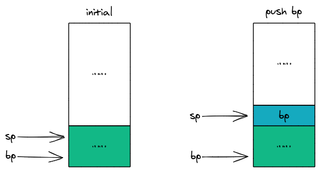

Then modify the `base pointer` (bp) to the current value of the `stack pointer` (sp), making them both point to the same location (left diagram below). If the called function needs more stack space, it can continue moving the `stack pointer` (sp) toward lower addresses to allocate space (right diagram below). Finally, the `base pointer` and `stack pointer` again point to the `callee's` stack frame's `starting address` and `ending address` respectively.

Stack change process:

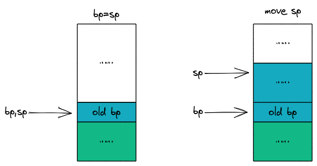

The stack frame stores function arguments, return address, saved registers, and local variables. A complete stack structure might look like this:

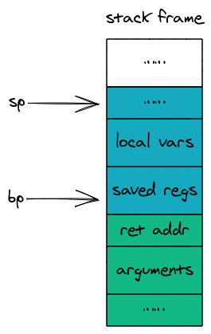

### Stack Frame Components

- **Arguments**

  In `X64`, if the function has more than 6 parameters, the first 6 are passed through registers, and the rest are passed through the stack. When there are 6 or fewer parameters, or no parameters, this part of the stack frame can be ignored.

  When parameters need to be passed through the stack, the `calling function` first pushes the parameters onto its own stack frame, and then the `called function` accesses the parameters from the `calling function's` stack frame. That's why the arguments section is in the caller's stack frame in the diagram.

- **Return Address (ret addr)**

  After pushing function arguments onto the stack, the address of the next instruction at the call site needs to be pushed, so the called function can return to the original location to continue execution after finishing. This address is the return address.

- **Saved Registers (saved regs)**

  This stores registers that need to be saved by the `callee`, such as the `old base pointer` (old bp).

- **Local Variables (local vars)**

  This part stores local variables in the stack rather than registers. If the function has no local variables or all local variables are stored in registers, this part of the stack frame can be ignored.

**If another function call occurs, the entire stack frame creation process repeats, so recursive functions are no different from regular functions.**

> **Stack Alignment Requirement**: In X64, the stack pointer must be 16-byte aligned during function calls (before the `call` instruction executes, rsp must be a multiple of 16). This is because certain SSE instructions require 16-byte aligned operands. The compiler automatically inserts padding to meet alignment requirements, so sometimes you'll see unused space in the stack frame.

## 7.2 Destroying a Stack Frame

> When a function returns, the stack frame previously created for it is `destroyed` to release space.

When destroying, first move the `stack pointer` (sp) to the current `base pointer` (bp) position. At this point, the `stack pointer` and `base pointer` both point to the same location.

Stack change process:

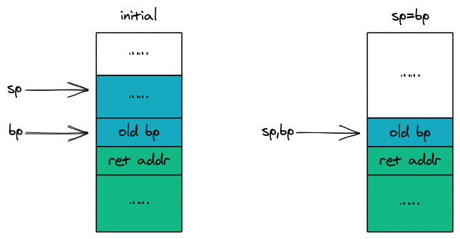

Now the top of the stack happens to be the caller's `stack frame's` `base pointer` that we saved when creating the stack frame. Pop it into the `base pointer` (bp) to get the stack structure shown below:

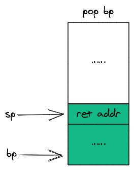

At this point, the `callee's` stack frame has been destroyed and the space released. However, the function return process is not complete. The `caller's` stack frame still holds the `return address`. Now the `return address` needs to be popped into the `Program Counter` (PC) to resume execution at the original location. The stack frame after returning:


**In C/C++, destroying a stack frame does not clear the data in the destroyed stack frame.**

---

# Chapter 8: C Function Stack Frame Example

> We will compile a piece of C code containing function calls into assembly and analyze the complete lifecycle of the function stack frame step by step.

Here is the C code:

```c
long callee(long arg1, long arg2, long arg3, long arg4, long arg5, long arg6, long arg7, long arg8) {
    return arg7 + arg8;
}

int main() {
    long a = 7;
    long b = 8;
    callee(1, 2, 3, 4 ,5 ,6, a, b);
    return 0;
}
```

The `callee` function has 8 parameters `arg1~arg8` and returns the sum of `arg7` and `arg8`. Since our code runs on an `X64` machine, `arg1~arg6` will be passed through registers, while `arg7` and `arg8` are passed through the stack. `main` defines two local variables `a` and `b`, and calls `callee`, where local variables `a,b` correspond to `callee`'s `arg7,arg8`.

Compiling the C code above into assembly and removing other instructions generated by the compiler that are not relevant to our stack frame analysis, we get the following instructions (the generated assembly instructions may vary depending on the compiler version and operating system; here we use `gcc9.0` and `ubuntu 20.04 x-64`):

```ASM
callee:
    pushq	%rbp
    movq	%rsp, %rbp
    movq	%rdi, -8(%rbp)
    movq	%rsi, -16(%rbp)
    movq	%rdx, -24(%rbp)
    movq	%rcx, -32(%rbp)
    movq	%r8, -40(%rbp)
    movq	%r9, -48(%rbp)
    movq	16(%rbp), %rdx
    movq	24(%rbp), %rax
    addq	%rdx, %rax
    popq	%rbp
    ret
main:
    pushq	%rbp
    movq	%rsp, %rbp
    subq	$16, %rsp
    movq	$7, -16(%rbp)
    movq	$8, -8(%rbp)
    pushq	-8(%rbp)
    pushq	-16(%rbp)
    movl	$6, %r9d
    movl	$5, %r8d
    movl	$4, %ecx
    movl	$3, %edx
    movl	$2, %esi
    movl	$1, %edi
    call	callee
    addq	$16, %rsp
    movl	$0, %eax
    leave
    ret
```

The `callee:` and `main:` in the instructions are labels for the instructions below them, which can be understood as function names.

**In `X64`, the `stack pointer` and `base pointer` are called `rsp` and `rbp` respectively.**

## 8.1 Creating main's Stack Frame

Let's analyze the impact of these instructions on the stack step by step. First, the first two instructions of `main`:

```asm
pushq	%rbp
movq	%rsp, %rbp
```

Actually, the `main` function is called by a system function called `_start`, so the first instruction pushes the `caller` _start's `base pointer` onto the stack to save it, and the second instruction moves the `base pointer` to point to the same location as the `stack pointer`.

Stack change process (initially our `stack pointer` and `base pointer` point to `_start`'s stack frame, which is not drawn here so they are not labeled):

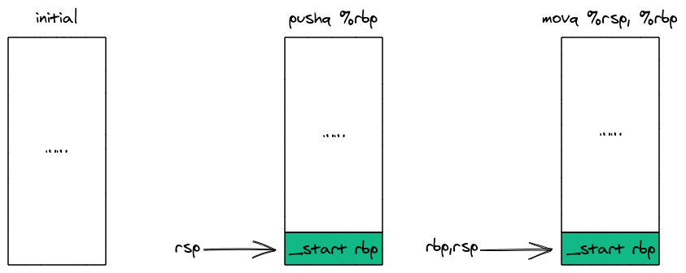

## 8.2 Initializing Local Variables and Preparing Parameters

Initialize local variables and prepare the last two parameters for `callee`:

```asm
subq	$16, %rsp
movq	$7, -16(%rbp)
movq	$8, -8(%rbp)
pushq	-8(%rbp)
pushq	-16(%rbp)
```

The `subq` in the first instruction is a subtraction instruction, used here to subtract 16 from the `stack pointer`, moving it toward lower addresses to allocate 16 bytes of space for local variables `a,b` (long occupies 8 bytes).

The `movq` in instructions 2-3 is a data movement instruction, which assigns values to `a,b` by offsetting from the `base pointer`. For example, `movq $7, -16(%rbp)` means putting 7 into memory at offset -16 relative to the `base pointer`. In the diagram below, you can see that after these two instructions execute, variables `a,b` are placed at positions `-16` and `-8`.

Instructions 4-5 copy the values of `a,b` from the stack frame and push them, preparing the last 2 parameters `arg7` and `arg8` for function `callee`.

Stack change process (the numbers on the right side of the diagram represent offsets relative to the `base pointer`, each cell is 8 bytes; since stack space grows toward lower addresses, offsets above the `base pointer` are negative):

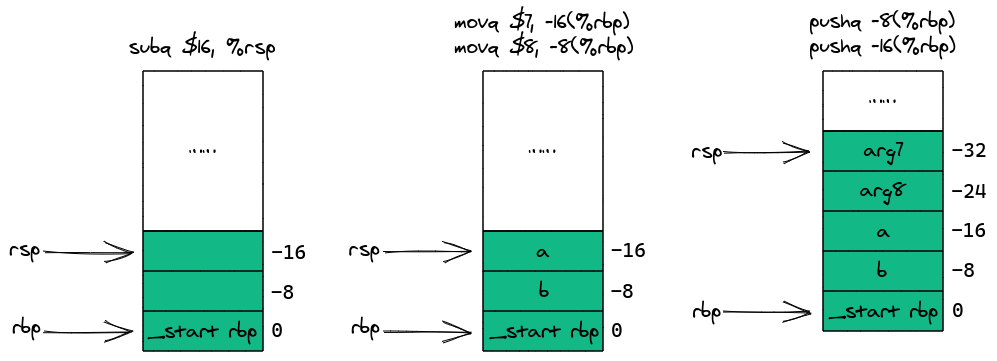

## 8.3 Storing Parameters in Registers

Store the first 6 parameters `arg1~arg6` of `callee` in registers:

```asm
movl	$6, %r9d
movl	$5, %r8d
movl	$4, %ecx
movl	$3, %edx
movl	$2, %esi
movl	$1, %edi
```

## 8.4 Calling callee

Start calling `callee`:

```asm
call	callee
```

This instruction corresponds to two operations: first, push the address of the instruction below it, which is the address of `addq $16, %rsp` (the return address), onto the stack, then modify the `Program Counter` (PC) to the address of `callee`'s first instruction. Finally, the CPU starts executing from `callee`.

The stack after this instruction executes:

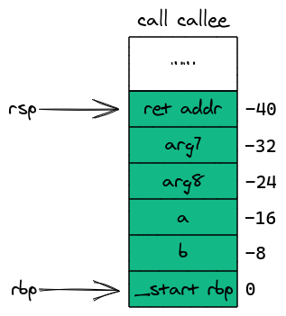

## 8.5 Creating callee's Stack Frame

Now the CPU starts executing from `callee`:

```asm
pushq	%rbp
movq	%rsp, %rbp
```

First push `main`'s stack frame's `base pointer`, then move the `base pointer` to point to the same location as the `stack pointer`. At this point, `callee`'s stack frame is created:

The second instruction changes the `base pointer`, so the offsets relative to the `base pointer` in the right diagram also need to change (since stack space grows toward lower addresses, offsets below the `base pointer` are positive):

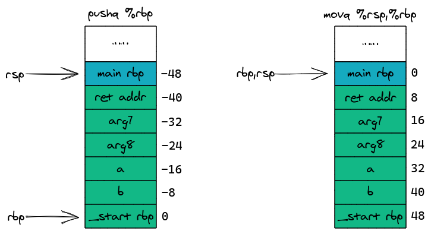

## 8.6 Copying Parameters to Stack Frame

Copy the first 6 parameters to the stack frame:

```asm
movq	%rdi, -8(%rbp)
movq	%rsi, -16(%rbp)
movq	%rdx, -24(%rbp)
movq	%rcx, -32(%rbp)
movq	%r8, -40(%rbp)
movq	%r9, -48(%rbp)
```

These 6 registers `rdi,rsi,rdx,rcx,r8,r9` contain `callee`'s first 6 parameters, which are now copied from registers to `callee`'s own stack frame. The compiler does this for several reasons: (1) The function body may need to get the address of a parameter (like `&arg1`), but registers don't have memory addresses; (2) Registers are limited, and complex functions need to free up registers for other computations; (3) Compiler optimization is not enabled here (`-O0`); with optimization enabled, these redundant operations would be eliminated.

Stack structure after execution:

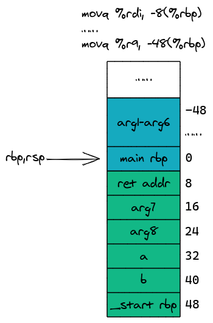

Something strange happens here - the `stack pointer` doesn't continue moving toward lower addresses to point to the top of the stack. This is actually related to the **Red Zone** concept in the X64 ABI.

> **Red Zone**: In the X64 System V ABI, the 128 bytes below the stack pointer are called the "red zone." Leaf functions (functions that don't call other functions) can use this area to store temporary data without moving the stack pointer. This saves `subq` and `addq` instructions, improving efficiency. However, if a function calls other functions, the red zone data may be overwritten, so only leaf functions can use the red zone.

Since `callee` doesn't call any other functions (it's a leaf function), it can directly use the red zone without modifying the `stack pointer`.

## 8.7 Executing the Addition

Execute the addition:

```asm
movq    16(%rbp), %rdx
movq	24(%rbp), %rax
addq	%rdx, %rax
```

Add `arg7` and `arg8` together, then put the result in the `rax` register. The `main` function can access the `rax` register to get the return value, thus achieving function return value passing.

## 8.8 Returning to main

Return to `main`:

```asm
popq	%rbp
ret
```

Restore the `base pointer` and jump to the return address to continue execution.

Stack change process:

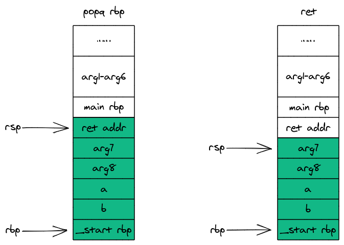

## 8.9 Returning to _start

Return to `_start`:

```asm
addq	$16, %rsp
movl	$0, %eax
leave
ret
```

The `addq` in the first instruction is an addition instruction, used here to add 16 to the `stack pointer`, moving it toward higher addresses to release the memory for `arg7,arg8`. From this step, we can see that parameters' stack memory is released immediately after the function finishes executing.

The second instruction puts `main`'s return value 0 into the `eax` register.

The third instruction `leave` implicitly performs two operations, equivalent to these two instructions:

```asm
movq	%rbp, %rsp
popq	%rbp
```

First modify the `stack pointer` to point to the same location as the `base pointer` - this step mainly releases local space - then restore the `base pointer`. At this point, the `stack pointer` and `base pointer` now point to `_start`'s stack frame.

Here we notice that `main` and `callee` have different return processes. This is because `callee` didn't use the `subq` instruction to modify the `stack pointer` to allocate local space at the beginning, so it doesn't need to use the `leave` instruction to restore the `stack pointer` when returning. From this, we can conclude: functions that call other functions and functions that don't call other functions have slightly different return processes.

The fourth instruction `ret` makes the CPU return to `_start` to continue execution, and everything returns to calm.

Stack change process:

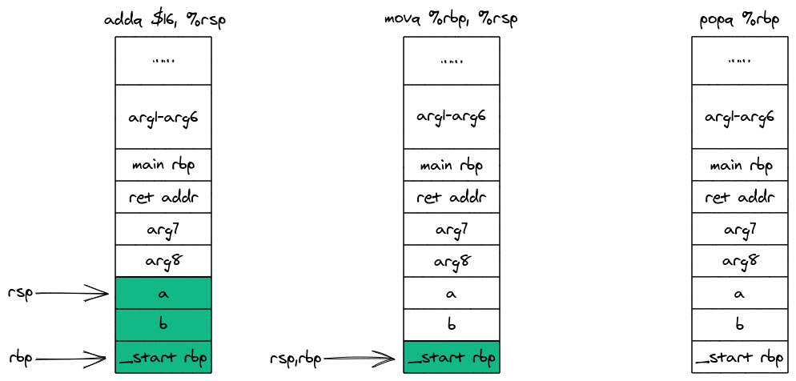

**Finally, we notice that data is still preserved in the stack, because releasing stack space doesn't modify the data inside - it just moves the `stack pointer` and `base pointer`.**

---

# Chapter 9: Stack Frame Memory Reuse

Here's a C language example:

```c
void init_array() {
    int arr[10];
    for (int i = 0; i < 10; ++i) {
        arr[i] = i;
    }
}

void print_array() {
    int arr[10];
    for (int i = 0; i < 10; ++i) {
       printf("%d\t", arr[i]);
    }
}

int main() {
    init_array();
    print_array();
}
```

In the code, `init_array` and `print_array` each have a local array `arr` of length 10. `init_array` initializes its internal `arr` to 0~9, `print_array` iterates through its internal `arr` and outputs to the console, and then they are called in the `main` function.

Output to console after `print_array` executes:

```bash
0	1	2	3	4	5	6	7	8	9
```

The result is a bit puzzling - it seems these two functions have some kind of relationship.

Now let's remove the call to `init_array` and see the result:

```bash
177988	32765	5497827	21857	2157688	32518	9257904	21857	0	0
```

This time it outputs random values, because C/C++ doesn't initialize memory values - these values were left behind by the previous program that used this memory.

Comparing the two results, we can see that `init_array` did indeed affect the array `arr` in `print_array`. The `arr` in `init_array` and `print_array` appear to be independent of each other, so why does this happen?

Let's look at the stack frame structure of these two functions before they return:

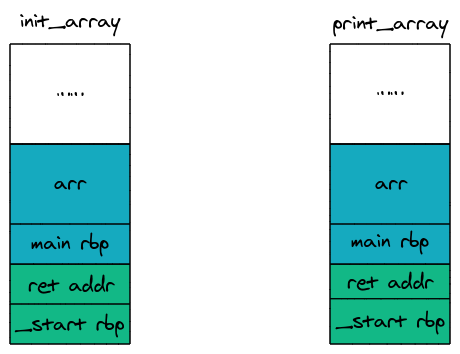

We can see that their stack frame structures and sizes are exactly the same. After `init_array` finishes executing, its stack frame is destroyed, but the original values remain in memory. When `print_array` executes, it's allocated the same block of memory and has the same stack frame structure, so it picks up the data left behind by `init_array` in memory.

Let's slightly modify the code to have both functions output their respective `arr` memory addresses to the console:

```c
void init_array() {
    int arr[10];
    printf("%p\n", arr);
}

void print_array() {
    int arr[10];
    printf("%p", arr);
}

int main() {
    init_array();
    print_array();
}
```

Console result:

```bash
0x7ffd2aaf3ff0
0x7ffd2aaf3ff0
```

The result once again confirms that these two `arr` arrays were placed in the same stack memory. So `print_array` outputs the values that were originally in `arr` from `init_array`.

---

# Chapter 10: Manually Modifying Stack Frame Data

> We can get the memory address of a local variable and then offset that address to modify data at other locations in the stack. As long as we understand the stack structure well enough, we can modify whatever data we want.

## 10.1 Modifying Local Storage

> Since C/C++ doesn't check for array out-of-bounds access, we can use this feature to modify data in the stack frame.

Here is the code:

```c
int main() {
    long foo = 10;
    long arr[2] = {1, 2};
    arr[-1] = 20;
    printf("foo is %ld", foo);
    return 0;
}
```

In the code, the array `arr` and variable `foo` are stored contiguously in the stack:


The diagram also shows that variable `foo` is placed at a lower address, so when modifying `arr[-1]`, we're also modifying variable `foo`.

Console output:

```bash
foo is 20
```

### Stack Canary

In this example's stack frame, there's an extra `canary` at the bottom, which is used to prevent stack overflow attacks. When entering a function, an arbitrary value is first placed above the `return address`, and then when returning, this value is checked to see if it has been modified. If it has been modified, it indicates that other data in the stack frame may also have been modified, and a related exception is triggered. This value is called a `canary`.

The compiler only generates `canary`-related instructions when there are pointer operations within the function. We use an array here, and array operations in C/C++ are actually pointer operations, so a `canary` is generated here.

## 10.2 Modifying the Return Address

> Similarly, we can offset a memory address appropriately to modify a function's return address, thereby controlling the function's return path.

Here is the code:

```c
void bar() {
    printf("This is bar!\n");
}

void foo() {
    printf("This is foo!\n");
    long arr[2] = {1, 2};
    arr[5] = bar;
}

int main() {
    foo();
    return 0;
}
```

In this example, the return address is stored at position `arr[5]`. To understand why it's 5, let's first look at the stack frame structure before `foo` returns (green is main's stack frame, blue is foo's stack frame):

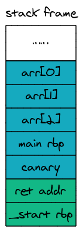

Now counting down from `arr[0]`, the function return address happens to be at position `arr[5]`. We modify it to the address of function `bar` (in C/C++, a function name represents the address of the function's first instruction) and then execute. We get the following console output:

```bash
This is foo!
This is bar!
Segmentation fault (core dumped)
```

As expected, we successfully jumped to `bar`, but we also got a `segmentation fault`. Why does this `segmentation fault` occur? Let's look at the stack frame changes before and after `bar` runs (green is main's stack frame, blue is bar's stack frame):

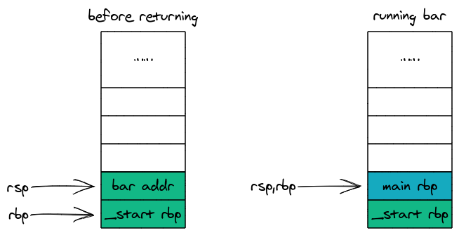

The left diagram above shows the stack frame state before the `ret` instruction executes. At this point, the `stack pointer` and `base pointer` have been restored to the state before calling `foo`. The right diagram shows after the `ret` instruction executes - at this point `bar addr` has been popped from the stack, then jumped to `bar` for execution, and `bar` has also created its own stack frame. Now let's imagine what happens when `bar` returns. Obviously, it will use `_start rbp` as the `return address`. `_start rbp` is not an instruction address, so when the CPU treats it as an instruction address and tries to find an instruction, a `segmentation fault` occurs.

**In both examples, we modified stack frame data but no exceptions occurred - the `canary` seems to have not worked. The reason no exception was triggered is because I skipped the `canary` and didn't modify it. The `canary` can prevent modification of a contiguous block of space; if that space happens to contain the `canary`, an exception will be triggered.**

**These two examples also demonstrate that array out-of-bounds access can lead to very serious bugs.**

---

# Chapter 11: Summary

> So far we have mastered all the details of function calls. Now let's use this knowledge to answer some function-related questions.

## Why should we prefer loops over recursive calls?

Each function call requires initializing and destroying a stack frame, which incurs additional overhead. Also, when there are too many recursive calls, it will exhaust stack memory, eventually causing a stack overflow.

## Why are inline functions more efficient?

Inline functions are different from regular functions, but for developers, you can treat inline functions almost the same way as regular functions. In the instructions actually compiled by the compiler, the inline function's instructions are just copied into the caller's function, so no stack frame is initialized for it. This avoids the overhead brought by stack frames, and using inline functions can improve execution efficiency.

## Why aren't static variables released after the function returns?

This is because static variables are not in the stack memory region at all - they are stored in a place called the static area. So when the function returns, what's destroyed is the stack memory, which doesn't affect the static area.

## What is a stack overflow attack?

In the previous section, we discussed manually modifying a function's return address. Imagine what would happen if this address was modified by an attacker to the address of their own instructions? At this point, when the function returns, it would successfully switch to executing the attacker's code. This is a very old attack method, and there are now many protection methods, such as stack canary, non-executable stack data, and address space layout randomization (ASLR).

## What are the dangers of C/C++ array out-of-bounds access?

C/C++ doesn't check for array out-of-bounds access. This can cause the out-of-bounds memory you access to contain adjacent other variables, or even important data like function return addresses. If you also modify it, the consequences are hard to imagine, and array out-of-bounds bugs are usually very difficult to debug.

## Why can't you return a pointer to a local variable?

Local variables are stored in the stack frame. After the function returns, the stack frame is destroyed, and that memory may be overwritten by subsequent function calls. The returned pointer points to memory that is already invalid, and accessing it is undefined behavior, which may cause the program to crash or produce unpredictable results.

## What is tail recursion optimization?

When a recursive call is the last operation of a function, the compiler can reuse the current stack frame instead of creating a new one, thereby converting recursion into a loop and avoiding stack overflow. This optimization is called Tail Call Optimization (TCO). It requires optimization level `-O2` or higher to be enabled.

## What is the stack size limit?

The default stack size on Linux is usually 8MB (viewable and modifiable via `ulimit -s`), and Windows defaults to 1MB. Stack size is limited, which is why deep recursion or allocating overly large local arrays causes stack overflow.

---

*End of Guide*
